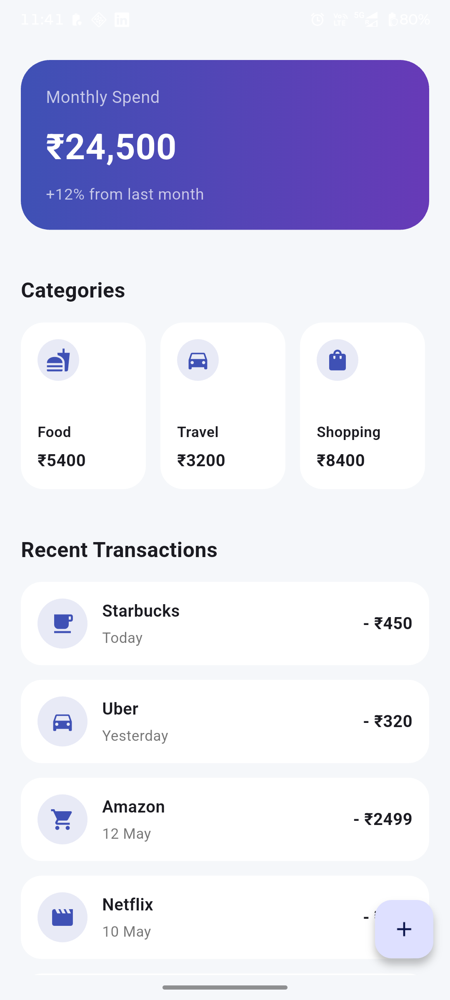

# Spend Summary App

A clean and modern Flutter UI application that displays a user's monthly spending overview, category-wise expenses, and recent transactions using mock data.

---

## Features

* Monthly spend summary card
* Percentage comparison with last month
* Horizontal category expense cards
* Recent transactions list
* Floating Action Button (FAB)
* Clean and reusable widget structure
* Responsive and modern UI design

---

## Tech Stack

* Flutter
* Dart
* Material 3

---

## Folder Structure

```text
lib/
├── main.dart
├── models/
│   ├── category_model.dart
│   └── transaction_model.dart
├── data/
│   └── mock_data.dart
├── screens/
│   └── spend_summary_screen.dart
├── widgets/
│   ├── spend_header_card.dart
│   ├── category_item.dart
│   ├── transaction_tile.dart
│   └── section_title.dart
└── theme/
    └── app_theme.dart
```

---

## Screenshots

### Spend Summary Screen



---

## AI Tools Used

The following AI tools were used during development:

* ChatGPT

  * UI planning
  * Folder structure guidance
  * Widget implementation suggestions
  * README generation

* GitHub Copilot

  * Boilerplate code assistance
  * Faster widget scaffolding

---

## Getting Started

### Prerequisites

* Flutter SDK installed
* Android Studio / VS Code
* Android Emulator or Physical Device

---

## Run the Project

```bash
flutter pub get
flutter run
```

---

## Mock Data

This application uses hardcoded/mock data only.
No backend or API integration has been implemented.

---

## Design Highlights

* Reusable widgets
* Consistent spacing and typography
* Material 3 design principles
* Simple and maintainable architecture

---

## Author

Manish Vishwakarma
